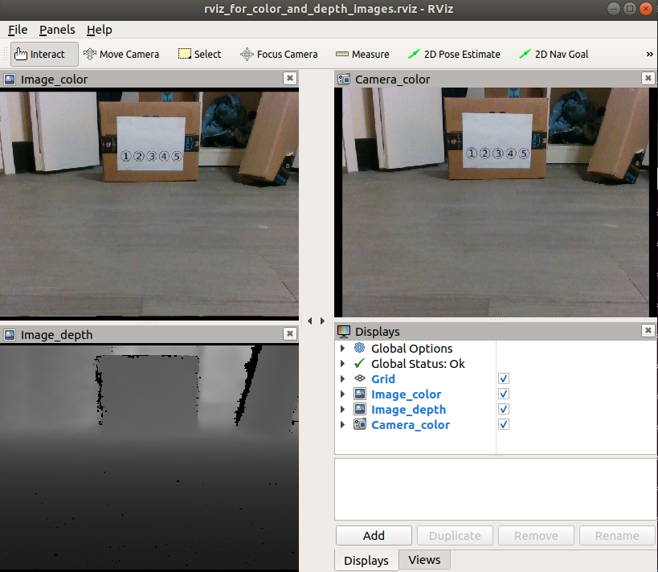

# ROS Images Publisher

A self-contained python script [publish_images.py](publish_images.py) for publishing color or depth images from a folder to ROS topic.

## Download

``` bash
cd ~/catkin_ws/src
git clone https://github.com/felixchenfy/ros_images_publisher
cd ros_images_publisher
chmod a+x publish_images.py
```

## See help by `-h`

```
$ rosrun ros_images_publisher publish_images.py -h

usage: publish_images.py [-h] -i IMAGES_FOLDER [-c CAMERA_INFO_FILE]
                         [-t TOPIC_NAME] [-r PUBLISH_RATE] [-f {color,depth}]

Publish color or depth images from a folder to ROS topic.

optional arguments:
  -h, --help            show this help message and exit
  -i IMAGES_FOLDER, --images_folder IMAGES_FOLDER
                        A data folder which contains .jpg or .png images for
                        publishing. (default: /home/feiyu/catkin_ws/src/ros_im
                        ages_publisher/data/color/)
  -c CAMERA_INFO_FILE, --camera_info_file CAMERA_INFO_FILE
                        File path of camera parameters. No distortion.
                        (default: /home/feiyu/catkin_ws/src/ros_images_publish
                        er/data/cam_params_realsense.json)
  -t TOPIC_NAME, --topic_name TOPIC_NAME
                        ROS topic name to publish image. (default:
                        test_data/image_raw)
  -r PUBLISH_RATE, --publish_rate PUBLISH_RATE
                        How many images to publish per second. (default: 1.0)
  -f {color,depth}, --format {color,depth}
                        Format of image: color (uint8, 3 channels), or depth
                        (uint16, 1 channel). (default: color)
```


## Exampe of usage

``` bash

publish_color_images(){
    roscd ros_images_publisher; ROOT=$PWD
    rosrun ros_images_publisher publish_images.py \
        --images_folder $ROOT/data/color/ \
        --topic_name test_data/color \
        --camera_info_file $ROOT/data/cam_params_realsense.json
}

publish_depth_images(){
    roscd ros_images_publisher; ROOT=$PWD
    rosrun ros_images_publisher publish_images.py \
        --images_folder $ROOT/data/depth/ \
        --topic_name test_data/depth \
        --camera_info_file "" \
        --format depth
}

set_camera_at_origin(){
    rosrun tf static_transform_publisher 0 0 0 0 0 0 1 map head_camera 10
}

run_rviz(){
    roscd ros_images_publisher; ROOT=$PWD
    rosrun rviz rviz -d $ROOT/rviz_for_color_and_depth_images.rviz
}

# https://stackoverflow.com/questions/3004811/how-do-you-run-multiple-programs-in-parallel-from-a-bash-script
# Run above 4 functions in parallel:
(trap 'kill 0' SIGINT; publish_color_images & publish_depth_images & set_camera_at_origin & run_rviz)

```

The result is shown below:
